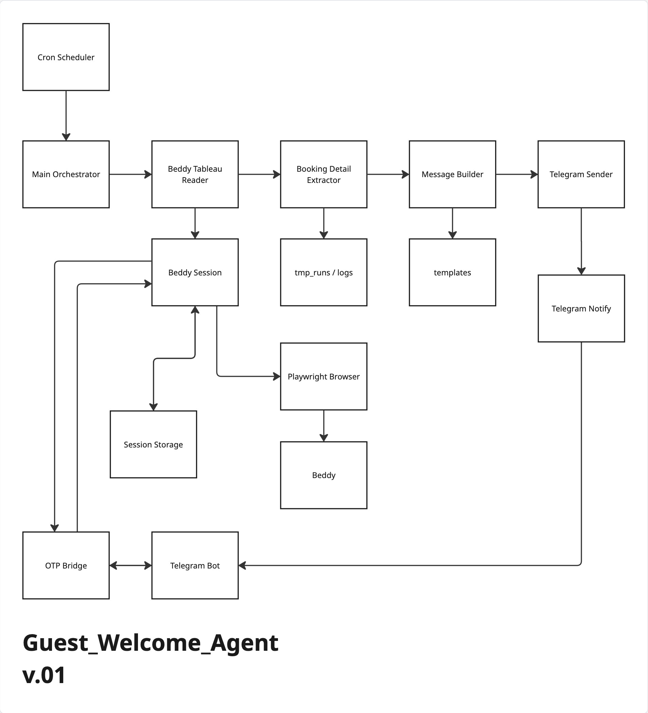
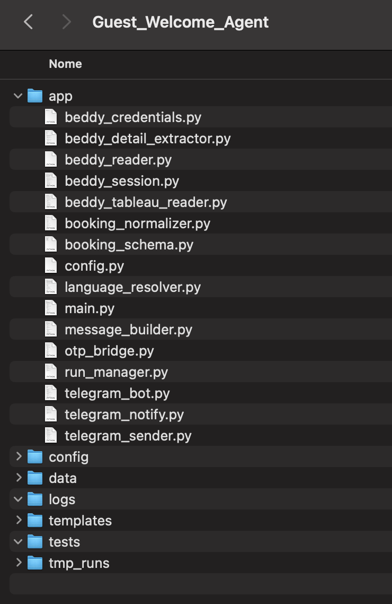

# Guest Welcome Agent

Operational messaging agent designed to detect next-day check-ins, prepare personalized welcome messages in the guest’s language, and deliver ready-to-send outputs through Telegram for final WhatsApp handling.

*Pre-communication workflow built to reduce manual friction in hospitality guest messaging while preserving human control over final delivery.*

Guest Welcome Agent is a focused operational system created to simplify a recurring hospitality task: preparing welcome communication for guests arriving the following day.

The project does not send messages directly through WhatsApp.  
Instead, it automates the preparation layer: identifying relevant bookings, extracting guest details, generating a personalized welcome message, and delivering a ready-to-use output through Telegram so a human operator can complete the final sending step.

## What it does

- Accesses the management system calendar and detects next-day check-ins
- Selects only the bookings relevant to the chosen arrival date
- Extracts guest details such as name, phone number, and country context
- Prepares a personalized welcome message using the guest’s name
- Adapts the message to the language associated with the guest’s country of origin
- Sends the ready-to-copy message package through Telegram for final human handling on WhatsApp

## System structure

- **Booking detection layer**  
  The system accesses the calendar and identifies bookings with check-in scheduled for the following day.

- **Selection layer**  
  Only the reservations relevant to the target date are included in the workflow.

- **Message preparation layer**  
  Guest data is used to prepare a structured welcome message with personalized content and language adaptation.

- **Delivery layer**  
  The final output is sent to Telegram as a ready-to-use message package for manual WhatsApp sending.

## System flow

The system operates as a scheduled guest-communication preparation workflow:

1. A cron scheduler starts the daily process.
2. The main orchestrator launches the operational sequence.
3. A Beddy tableau reader accesses the booking calendar and identifies the relevant next-day check-ins.
4. A booking detail extractor collects the reservation data needed for communication.
5. Temporary run files and logs preserve the execution state.
6. A message builder generates the welcome message using predefined templates and guest-specific data.
7. A language-resolution layer helps adapt the message to the guest’s expected language.
8. The prepared message package is sent through Telegram.
9. Telegram notifications report execution progress and final status.
10. Session storage and the OTP bridge support authentication continuity and recovery when needed.

## Architecture diagram

## Operational proof

This system was designed as a real hospitality guest-communication workflow, not as a conceptual prototype.  
It identifies next-day arrivals, extracts booking context, builds ready-to-send welcome messages, and delivers them through Telegram while preserving human control over the final WhatsApp sending step.

## Input / Output

**Input**
- Scheduled daily trigger
- Booking calendar data from Beddy
- Reservation details required for guest communication
- Message templates
- Session and authentication state

**Intermediate outputs**
- Extracted booking context
- Temporary run files and execution logs
- Language selection / message adaptation logic
- Structured message packages ready for delivery

**Final output**
- Personalized welcome messages prepared for each relevant guest
- Telegram delivery of name, contact context, and ready-to-use message content
- Telegram notifications confirming workflow progress and completion

## Component roles

- **Cron Scheduler**  
  Starts the recurring daily workflow.

- **Main Orchestrator**  
  Coordinates the full execution sequence.

- **Beddy Tableau Reader**  
  Reads the booking calendar and identifies relevant next-day arrivals.

- **Booking Detail Extractor**  
  Extracts the reservation details required for message preparation.

- **Beddy Session**  
  Preserves operational continuity with the management system.

- **Session Storage**  
  Stores reusable session state across runs.

- **Playwright Browser**  
  Opens and navigates the live management platform.

- **Message Builder**  
  Generates the personalized welcome message.

- **templates**  
  Stores reusable communication templates.

- **Telegram Sender**  
  Sends the prepared message package into Telegram.

- **Telegram Notify**  
  Sends progress and status notifications for the workflow.

- **Telegram Bot**  
  Supports Telegram-based operational interaction and delivery flow.

- **OTP Bridge**  
  Handles recovery when login requires OTP verification.

- **tmp_runs / logs**  
  Preserve temporary execution state and operational traceability.

## Why this architecture exists

This system is structured as a layered communication-preparation workflow because guest messaging in a live hospitality environment involves more than just sending text.

The process requires booking selection, reservation-context extraction, session continuity, message generation, template usage, language adaptation, and reliable delivery into a human-controlled channel.  
By separating those responsibilities into distinct layers, the architecture becomes easier to supervise, debug, and evolve over time.

Instead of fully automating the final guest communication step, the system is intentionally designed to automate preparation while preserving human control over the final WhatsApp sending phase.

## Real-world constraints

This project was designed around real operational constraints, including:

- daily next-day arrival checks
- booking-calendar extraction from a live management platform
- session persistence and login recovery
- multilingual guest communication needs
- reusable template-based message building
- Telegram as the delivery layer for human review
- preserving human supervision over the final outbound message

Because of these constraints, the architecture prioritizes reliability, clarity, and operational augmentation over fully autonomous messaging.

## Project structure

The repository is organized as a layered operational system, with separate modules for booking reading, reservation extraction, language resolution, message generation, Telegram delivery, notification handling, and session continuity.

The structure reflects the workflow described above: booking logic, messaging logic, and delivery logic remain separated so the system can prepare guest communications reliably while preserving clear operational control and human validation at the final step.

## Why it matters

Guest messaging is an important part of hospitality operations, but preparing personalized messages every day can become repetitive and operationally inefficient.  
This project exists to automate the preparation phase while preserving human supervision over the final communication step.

Its value lies in reducing manual workload, improving consistency, and accelerating guest-contact workflows without forcing full communication automation.

## Operational logic

Guest Welcome Agent is built around a hybrid workflow:

- detect relevant arrivals
- prepare the right message
- adapt it to the guest context
- deliver it in ready-to-send form
- leave final message sending under human control

This makes it a strong example of operational augmentation rather than full replacement.

## Status

Active internal project with functioning booking detection, guest-data extraction, language-based message preparation, and Telegram delivery flow.  
The system is already operational as a practical support layer for hospitality guest communication.

## Scope

This project is designed as a focused internal workflow automation system for a specific hospitality communication task.  
It is not intended as a general messaging platform, but as a custom operational layer built around booking visibility, guest context, and structured pre-communication support.
